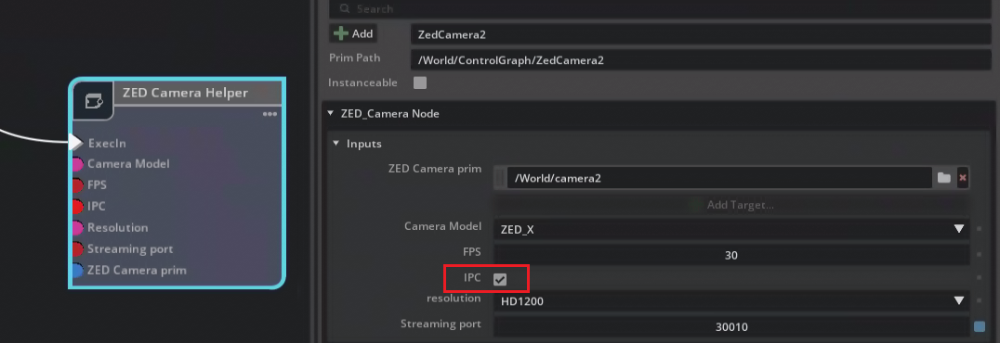
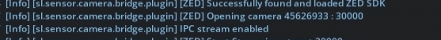
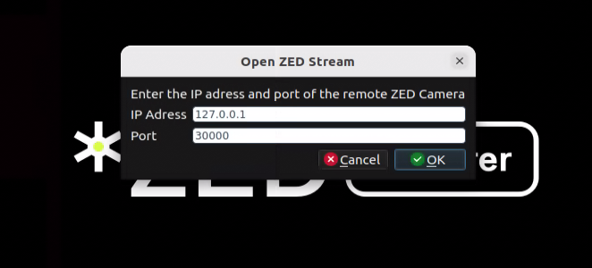

# zed-isaac-sim

ISAAC Sim integration for ZED SDK.

The ZED camera extension streams your virtual ZED camera data to the ZED SDK.

## Getting Started

### Requirements

- Linux Ubuntu 22.04 or Windows 10/11
- [NVIDIA Isaac SIM Requirements](https://docs.isaacsim.omniverse.nvidia.com/latest/installation/requirements.html)
- [Isaac SIM >=4.5.0 (Workstation or Container)](https://docs.isaacsim.omniverse.nvidia.com/latest/installation/install_workstation.html)

### Installation

1. Clone the repository
2. Run ./build.bat on Windows or ./build.sh on Linux to build the extension.

## Usage

1. Launch Isaac Sim
2. Open **Window -> Extensions** from the top menu
3. In the Extensions manager window (hamburger button near search field), open **Settings**.
4. Click the "+" button and add the path to your cloned repo + `/exts`

  

5. Enable the `ZED Camera` extension in the Third-Party tab.

  

Then, In your scene,

1. Add a ZED Camera

2. Create a new Action Graph similar to this :

### Using IPC

It is now possible to stream images to the ZED SDK using IPC instead of RTSP.
This feature is only available on Linux and only when streaming to the same machine.

To use IPC:

- In the action graph, enable the "IPC" option in the ZED Camera Helper node. It is enabled by default.

Once streaming has started, you should see the following message in the console window:

  

**Important**:

To receive a stream using IPC, the IP address must be set to `127.0.0.1` or `localhost`.

For example, in ZED Explorer:

- Set the IP to 127.0.0.1

  

- On the top-left corner, the streaming mode will be displayed:

