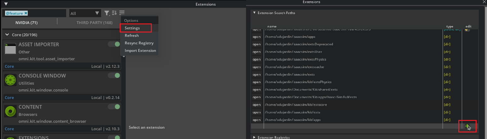
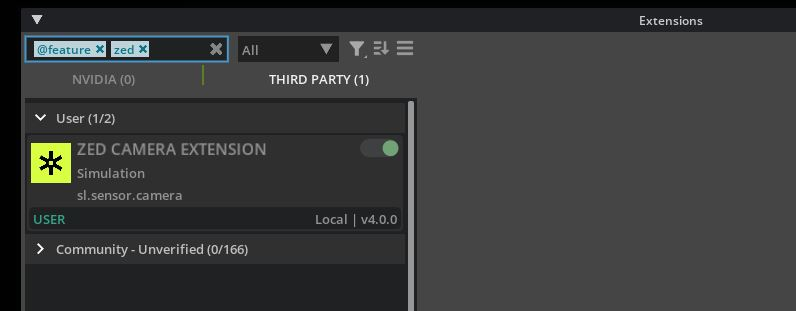
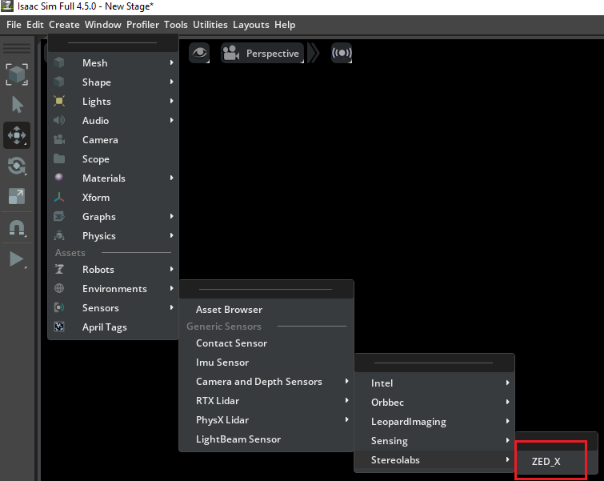
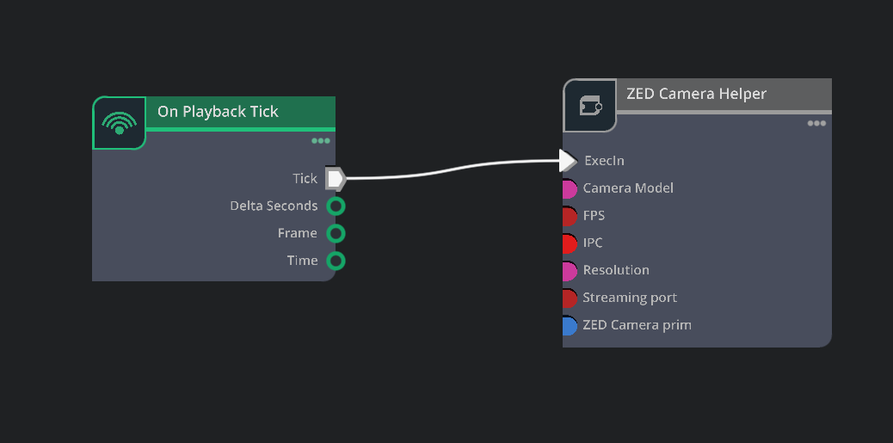
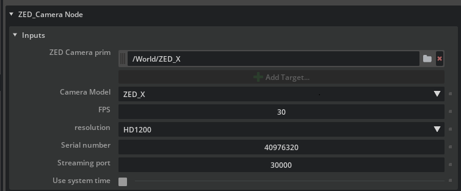

## Getting Started

### Requirements

- Linux Ubuntu 22.04 or Windows 10/11
- [NVIDIA Isaac SIM Requirements](https://docs.isaacsim.omniverse.nvidia.com/latest/installation/requirements.html)
- [Isaac SIM >=4.5.0 (Workstation or Container)](https://docs.isaacsim.omniverse.nvidia.com/latest/installation/install_workstation.html)
- [ZED SDK > 5.0.1](https://www.stereolabs.com/en-fr/developers/release)

### Installation

1. Clone the repository
2. Run ./build.bat on Windows or ./build.sh on Linux to build the extension.

## Usage

1. Launch Isaac Sim
2. Open **Window -> Extensions** from the top menu
3. In the Extensions manager window (hamburger button near search field), open **Settings**.
4. Click the "+" button and add the path to your cloned repo + `/exts`

  

5. Enable the `ZED Camera` extension in the Third-Party tab.

  

Then, In your scene,

1. Add a ZED Camera 

2. Create a new Action Graph similar to this : 

