# ZED Camera Integration for NVIDIA Isaac Sim


**Build, test, and train your physical AI before the hardware even exists.**

This extension brings faithful digital twins of every [Stereolabs ZED camera](https://www.stereolabs.com/)
into [NVIDIA Isaac Sim](https://developer.nvidia.com/isaac/sim)'s photorealistic simulation. Your simulated
ZED streams to the ZED SDK exactly like a real camera would, so the exact software you ship (perception,
navigation, your ROS 2 stack) runs **unchanged**, software-in-the-loop, in a fully repeatable virtual world.

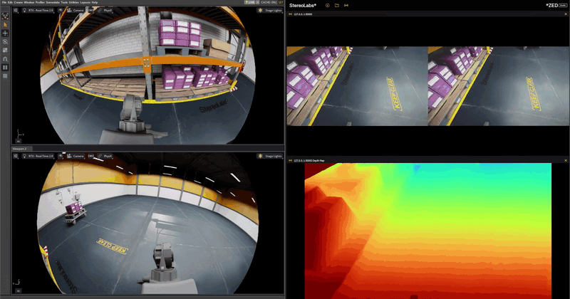

*A simulated ZED streaming live from Isaac Sim into ZED Studio, with the stereo pair (top right) and the
ZED SDK's stereo-matched depth (bottom right).*

**What you get:**

- ✅ Every ZED camera as a calibrated **digital twin**: stereo and mono models, with their lens variants
- ✅ Stereo images + IMU streamed to the **ZED SDK** and **ZED ROS 2 Wrapper**, with **zero code change**
- ✅ **Ground-truth depth** streaming, straight into your ZED SDK pipeline
- ✅ **ZED Sim2Real**, a realistic camera model that adds real-world imaging on top of the clean render *(experimental)*
- ✅ ZED observations as **GPU tensors** in Isaac Lab, for reinforcement & imitation learning
- ✅ **SDK-free** RGB + depth capture for quick synthetic datasets
- ✅ **Multi-camera streaming**: several cameras on one robot or a whole fleet in one scene, stereo and mono mixed, all streaming simultaneously
- ✅ Low-latency **IPC** streaming and virtual stereo pairs
- ✅ **Turnkey demo scenes** with Franka, humanoid, and AMR robots carrying ZEDs ([demo extension](exts/sl.sensor.camera.demo/docs/README.md))

## Three ways to consume ZED data

| Path | What you get | ZED SDK needed? | Docs |
|---|---|---|---|
| **1. Stream to the ZED SDK** | Simulated camera streamed over RTP or IPC to any ZED SDK app, including depth (optional) and IMU. | Yes (receiver side) | [Extension reference](exts/sl.sensor.camera/docs/README.md) |
| **2. Isaac Lab tensors** | Stereo RGB + depth as in-process torch tensors, no network. The path for RL / imitation learning. | No | [Isaac Lab examples](exts/sl.sensor.camera/examples/isaaclab/README.md) |
| **3. SDK-free depth capture** | RGB + renderer depth (`distance_to_image_plane`), optionally saved as PNG/EXR. | No | [Isaac Sim examples](exts/sl.sensor.camera/examples/isaac_sim/README.md) |

Paths 2 and 3 use *simulated* depth from the renderer - not the ZED SDK's stereo-matched depth. Only
path 1 exercises real ZED SDK depth. This repo ships three extensions under [`exts/`](exts/); the core
one is `sl.sensor.camera`.

## ZED Sim2Real camera model (experimental)

Simulated images are too clean. The **ZED Sim2Real** model narrows the sim-to-real gap by reproducing
the real ZED X's imaging on top of the render: lens blur, vignetting, temporal auto-exposure, color
response, and gain-coupled sensor noise. It can be toggled live while the simulation is playing.

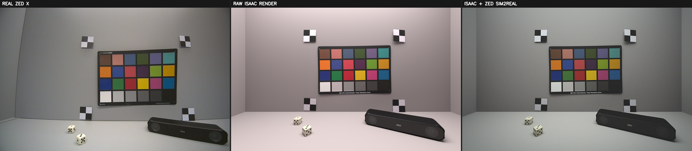

*Left: real ZED X. Middle: raw Isaac Sim render. Right: the same render with the ZED Sim2Real model applied.*

Enable it with the **Apply** toggle in the *ZED Sim2Real* section of the ZED Camera Helper node, or pass
`--apply_zed_sim2real` to the Isaac Lab examples. See the
[core extension reference](exts/sl.sensor.camera/docs/README.md#zed-sim2real-camera-model-experimental).

## Contents

- [Requirements](#requirements)
- [Install](#install)
- [Quick start: stream to the ZED SDK](#quick-start-stream-to-the-zed-sdk)
- [Streaming depth to the ZED SDK](#streaming-depth-to-the-zed-sdk)
- [IPC streaming (same machine)](#ipc-streaming-same-machine)
- [Virtual stereo cameras](#virtual-stereo-cameras)
- [Examples and scripts](#examples-and-scripts)
- [Documentation map](#documentation-map)

## Requirements

- Linux Ubuntu 22.04, or Windows 10/11
- [NVIDIA Isaac Sim 6.0](https://docs.isaacsim.omniverse.nvidia.com/latest/installation/install_workstation.html)
  (Kit 110.1.2) - see the [version compatibility table](exts/sl.sensor.camera/docs/README.md#compatibility)
  for older Isaac Sim releases
- To receive streams (path 1): the [ZED SDK](https://www.stereolabs.com/developers/release) **5.4.1 or newer**
- To read tensors (path 2): an [Isaac Lab](https://isaac-sim.github.io/IsaacLab/) install

## Install

1. Clone the repository.
2. Build the extension - this downloads the runtime ZED library and compiles the C++ plugin:
   ```bash
   ./build.bat      # Windows
   ./build.sh       # Linux
   ```
3. Register the extensions in Isaac Sim:
   - Open **Window -> Extensions**.
   - In the Extensions manager (hamburger menu near the search field), open **Settings**.
   - Click **+** and add the path to your cloned repo + `/exts`.

     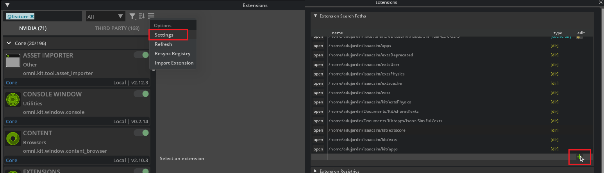
   - Enable **Stereolabs ZED Camera** in the *Third-Party* tab.

     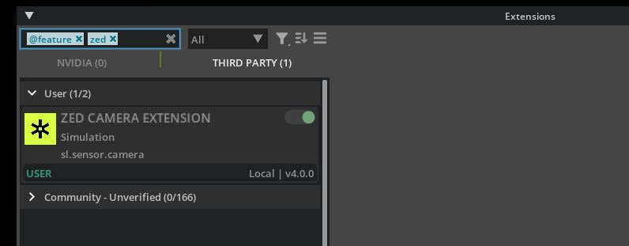

## Quick start: stream to the ZED SDK

1. Add a ZED camera to your stage - drag a ZED USD model from the extension's `data` folder in the
   Content Browser (ZED X, ZED X Mini, ZED X One, ZED Mini, ...).

   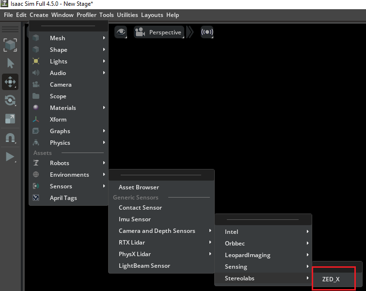

2. Create an Action Graph and wire an **On Playback Tick** into a **ZED Camera Helper** node, then set
   the node's **ZED Camera Prim** to your camera.

   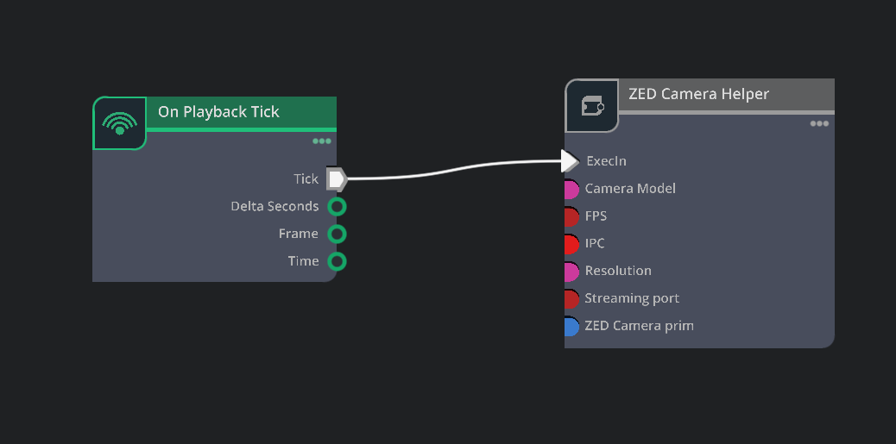
   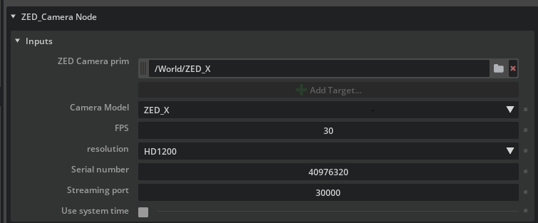

   For a single **ZED X One** (mono) or a virtual stereo pair, use the **ZED Camera One Helper** node
   instead. Its *Serial Number* input only matters for virtual stereo cameras.

   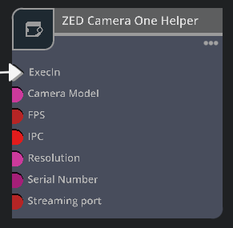

3. Press **Play**, then open the stream in any ZED SDK app (e.g. ZED Explorer) using the streaming port
   (default `30000`). See the [ZED SDK Streaming API](https://www.stereolabs.com/docs/video/streaming).

For every node parameter, the full camera-model list, depth streaming, and troubleshooting, see the
[extension reference](exts/sl.sensor.camera/docs/README.md). A step-by-step tutorial is on the
[Stereolabs docs site](https://www.stereolabs.com/docs/isaac-sim/isaac_sim).

## Streaming depth to the ZED SDK

By default the node streams the left + right stereo pair. Enable **Stream Depth** on the ZED Camera
Helper node to instead stream the **left image + a depth map** directly to the ZED SDK - Isaac Sim's
ground-truth depth is delivered through the SDK's `ingestCustomDepth` feature (requires ZED SDK 5.4.0
or newer). On the ZED Camera One Helper node,
Stream Depth requires a **virtual stereo pair** (both camera prims set); it is ignored for a single
mono camera. See the [extension reference](exts/sl.sensor.camera/docs/README.md#depth-streaming) for
details.

## IPC streaming (same machine)

For streaming to the ZED SDK on the **same machine**, IPC (shared memory) is faster than the network
path. Enable **IPC** (or **BOTH**) in the *Transport layer mode* of the ZED Camera Helper node - it is
on by default. IPC is supported on Linux and, as of v5.2.0, on Windows.

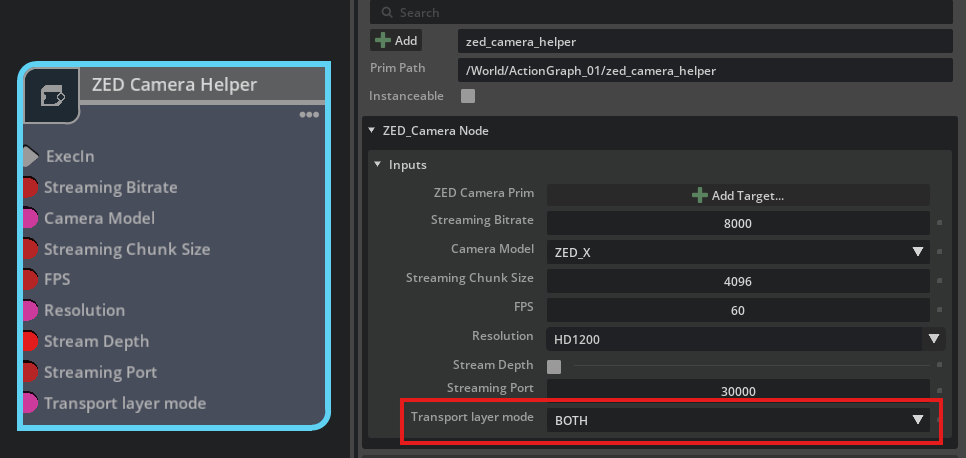

To receive an IPC stream, set the ZED SDK client's IP to `127.0.0.1` (or `localhost`) - for example in
ZED Explorer:

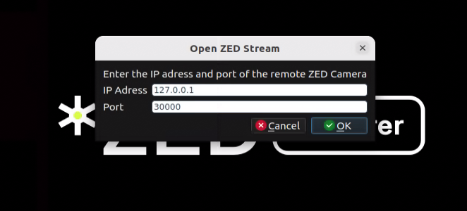
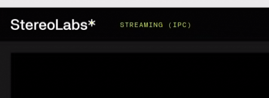

## Virtual stereo cameras

You can pair two **ZED X One** mono cameras into a "virtual stereo" ZED. This needs a one-time
calibration step, handled by the **ZED Calibration Exporter** extension: select the two camera prims,
pick a model and serial number, and generate a ZED-SDK-compatible `.conf` file. Then add a **ZED Camera
One Helper** node with both cameras set and the same serial number.

See the [Calibration Exporter guide](exts/sl.sensor.camera.calibration_exporter/docs/README.md) for the
full workflow.

## Examples and scripts

Standalone scripts live in [`exts/sl.sensor.camera/examples/`](exts/sl.sensor.camera/examples/), grouped
by the three data paths above:

- **[`examples/isaaclab/`](exts/sl.sensor.camera/examples/isaaclab/README.md)** - read stereo RGB + depth
  as in-process tensors in Isaac Lab (path 2), plus ports of flagship Isaac Lab demos (quadruped, Franka
  lift, imitation-learning HDF5 recording) with the real ZED_X model mounted on the robot.
- **[`examples/isaac_sim/`](exts/sl.sensor.camera/examples/isaac_sim/README.md)** - SDK-free RGB + depth
  capture inside Isaac Sim (path 3).
- **[`examples/fusion_calibration/`](exts/sl.sensor.camera/examples/fusion_calibration/README.md)** - write
  a ZED Fusion calibration JSON from camera prim poses, for multi-camera streaming setups (path 1).

## Documentation map

| Document | Covers |
|---|---|
| [Core extension reference](exts/sl.sensor.camera/docs/README.md) | Camera models, all OGN nodes, depth streaming, Python API, troubleshooting |
| [Core changelog](exts/sl.sensor.camera/docs/CHANGELOG.md) | Version history of `sl.sensor.camera` |
| [Examples overview](exts/sl.sensor.camera/examples/README.md) | Map of all standalone scripts |
| [Isaac Lab examples](exts/sl.sensor.camera/examples/isaaclab/README.md) | Tensor-path usage, arguments, output, demo ports |
| [Isaac Sim examples](exts/sl.sensor.camera/examples/isaac_sim/README.md) | SDK-free capture scripts |
| [Fusion calibration](exts/sl.sensor.camera/examples/fusion_calibration/README.md) | ZED Fusion pose export |
| [Calibration Exporter](exts/sl.sensor.camera.calibration_exporter/docs/README.md) | Virtual stereo `.conf` generation |
| [Warehouse demos](exts/sl.sensor.camera.demo/docs/README.md) | Turnkey Franka / humanoid / AMR demo scenes |
