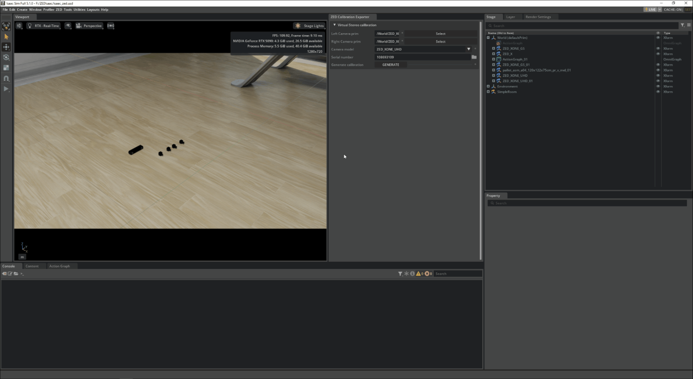

# Stereolabs ZED Calibration Exporter

Generate a ZED-SDK-compatible calibration file for a **virtual stereo camera** - a stereo pair built
from two **ZED X One** mono cameras placed in an Isaac Sim stage. The ZED SDK needs this `.conf` file to
treat the two independent mono streams as one calibrated stereo camera (for depth, tracking, etc.).

Use this together with the core `sl.sensor.camera` extension: this tool writes the calibration; the
**ZED Camera One Helper** node streams the pair using the same serial number.

## Workflow

1. Enable **ZED Calibration Exporter** in the *Third-Party* tab of the Extensions manager.
2. Open it from the menu bar: **Stereolabs -> ZED Calibration Exporter**. A window opens.
3. In the Stage, select the **left** camera prim, then click **Select** for the left camera. Repeat for
   the **right** camera.
4. Choose the **camera model** (base model) and the **lens type** (Wide, Narrow, or Fisheye). The lens
   list is filtered to the lenses available for the selected model.
5. Set the **serial number**, or keep the generated one. It must start with `11` (valid range
   `110000001`-`119999999`). Remember it - the streaming node needs the same value.
6. Click **Generate**. The `.conf` file is written to the ZED SDK settings directory:
   - **Windows:** `C:/ProgramData/Stereolabs/settings/`
   - **Linux:** `/usr/local/zed/settings/`

## Streaming the virtual stereo camera

In your Action Graph, add a **ZED Camera One Helper** node, set both the **Left** and **Right** camera
prims, and set its **Serial Number** to the value you used above. On Play, the pair streams as one stereo
ZED that the ZED SDK opens using the generated calibration.

## Output

The generated file is a ZED SDK `SN<serial>.conf` (INI format) saved in :

 - /usr/local/zed/settings/ On Linux.
 -  C:\ProgramData\Stereolabs\settings On Windows.

## Requirements

- The core `sl.sensor.camera` extension (for the ZED X One USD models and the streaming node).
- ZED SDK **5.4.1 or newer** on the receiving side.
